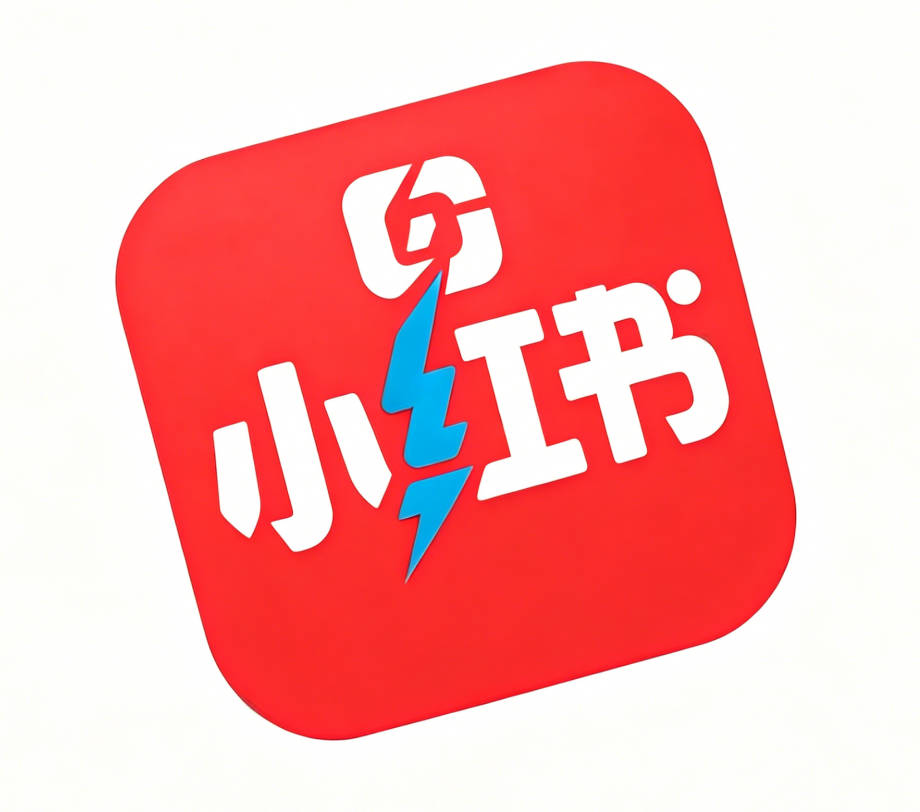

<p align="center">
  <a href="https://github.com/cv-cat/Spider_XHS" target="_blank">
    <picture>
      
    </picture>
  </a>
</p>

<div align="center">

# Spider_XHS

**专业的小红书数据采集 & 全域运营解决方案 & Agent Skills**

[](https://github.com/cv-cat/XhsSkills)
[](https://www.python.org/)
[](https://nodejs.org/)
[](LICENSE)

</div>

> **在 AI 大模型爆发的时代，内容运营的竞争本质是效率竞争。**
> 本项目封装了小红书平台完整的数据采集与内容发布能力，为开发者构建 AI 运营智能体提供可靠、稳定的底层 API 支撑。

**⚠️ 本项目仅供学习交流使用，禁止任何商业化行为，如有违反，后果自负**

---

## 为什么需要这个项目？

```
采集竞品笔记 ──► [Spider_XHS] ──► 你的 AI Agent（改写 / 生成 / 分析）──► 自动上传发布
                     ▲                                                        │
                     └──────────── 获取数据 / 管理账号 ◄──────────────────────┘
```

小红书没有开放完整的内容运营接口。想要接入 AI 大模型实现内容批量采集、智能改写、一键发布，首先需要能**稳定读写平台数据**。Spider_XHS 解决的正是这个前置问题：

- 逆向还原了小红书 PC 端与创作者平台的签名算法（x-s / x-t / x-s-common / x_b3_traceid / sign / q-signature参数）
- 封装全部核心 HTTP 接口，签名参数已透明处理
- 同时覆盖 **数据采集**（PC端）、**内容发布**（创作者平台）、**KOL数据**（蒲公英）三大场景

**你负责接 AI 大脑，我们负责打通小红书的神经。**

---

## ⭐ 已实现功能

| 模块 | 功能 | 状态 |
|------|------|------|
| **小红书 PC 端** | 二维码登录 / 手机验证码登录 | ✅ |
| | 获取主页所有频道 & 推荐笔记 | ✅ |
| | 获取用户主页信息 / 自己的账号信息 | ✅ |
| | 获取用户发布 / 喜欢 / 收藏的所有笔记 | ✅ |
| | 获取笔记详细内容（无水印图片 & 视频） | ✅ |
| | 搜索笔记 & 搜索用户 | ✅ |
| | 获取笔记评论 | ✅ |
| | 获取未读消息 / 评论@提醒 / 点赞收藏 / 新增关注 | ✅ |
| **创作者平台** | 二维码登录 / 手机验证码登录 | ✅ |
| | 上传图集作品 | ✅ |
| | 上传视频作品 | ✅ |
| | 查看已发布作品列表 | ✅ |
| **蒲公英平台** | 获取 KOL 博主列表 & 详细数据 | ✅ |
| | 获取博主粉丝画像 & 历史趋势 | ✅ |
| | 发起合作邀请 | ✅ |
| **千帆平台** | 获取分销商列表 & 详细数据 | ✅ |
| | 获取分销商合作品类 / 店铺 / 商品信息 | ✅ |

---

## 🤖 接入 AI 智能体

Spider_XHS 天然适合作为 AI 运营 Agent 的数据底座，以下是几种典型用法：

### 场景一：竞品笔记采集 + AI 改写 + 自动发布

```python
from apis.xhs_pc_apis import XHS_Apis
from apis.xhs_creator_apis import XHS_Creator_Apis

pc_api = XHS_Apis()
creator_api = XHS_Creator_Apis()

# 1. 采集竞品笔记
success, msg, note = pc_api.get_note_info(note_url, cookies_str)

# 2. 交给 AI 改写（接入任意大模型）
rewritten = your_ai_agent(note['content'])   # GPT / Claude / Qwen / 本地模型

# 3. 自动上传到创作者平台
creator_api.post_note({
    "title": rewritten['title'],
    "desc": rewritten['desc'],
    "media_type": "image",
    "images": [...],
    ...
}, creator_cookies_str)
```

### 场景二：关键词监控 + AI 情报分析

```python
# 搜索指定关键词的最新笔记，交给 AI 分析趋势
success, msg, notes = pc_api.search_some_note(query, require_num, cookies_str, ...)
analysis = your_ai_agent(notes)
```

### 场景三：KOL 筛选 + 智能匹配

```python
from apis.xhs_pugongying_apis import PuGongYingAPI

pgy = PuGongYingAPI()
# 获取目标类目的 KOL 数据，交给 AI 评估匹配度
kol_list = pgy.get_some_user(num=50, cookies=cookies)
best_kols = your_ai_agent(kol_list, brand_profile)
```

---

## 🧩 Skills 支持

当前项目已经支持基于 skills 的能力接入，既可以直接作为 `Spider_XHS` 的底层能力仓库使用，也可以通过标准化 skills 方式被上层 Agent 工具链引入。

如果你希望直接复用已经封装好的 skills，可以查看 [XhsSkills](https://github.com/cv-cat/XhsSkills)。该仓库专门用于存放基于 `Spider_XHS` 封装的 Agent Skills，目前可被 `Clawbot`、`Claude Code`、`Codex` 等支持 skills 的工具直接引入与集成。

---

## 🎨 爬虫效果图

### 处理后的所有用户


### 某个用户所有的笔记


### 某个笔记具体的内容


### 保存的 Excel


---

## 🛠️ 快速开始

### ⛳ 环境要求

- Python 3.10+
- Node.js 20+

### 🎯 安装依赖

```bash
pip install -r requirements.txt
npm install
```

### 🎨 配置 Cookie

在项目根目录的 `.env` 文件中填入你的登录 Cookie：

```
COOKIES='your_cookie_here'
```

Cookie 获取方式：浏览器登录小红书后，按 `F12` 打开开发者工具 → 网络 → Fetch/XHR → 找任意一个请求 → 复制请求头中的 `cookie` 字段。


> **注意：必须是登录后的 Cookie，未登录状态无效。**

### 🚀 运行项目

```bash
python main.py
```

### 🐳 Docker 部署（可选）

```bash
docker build -t spider_xhs .
docker run -e COOKIES='your_cookie_here' spider_xhs
```

---

## 📁 项目结构

```
Spider_XHS/
├── main.py                          # 主入口：爬虫调用示例
├── apis/
│   ├── xhs_pc_apis.py               # 小红书PC端完整API（采集）
│   ├── xhs_creator_apis.py          # 创作者平台API（上传发布）
│   ├── xhs_pc_login_apis.py         # PC端登录（二维码/手机验证码）
│   ├── xhs_creator_login_apis.py    # 创作者平台登录
│   ├── xhs_pugongying_apis.py       # 蒲公英平台API（KOL数据）
│   └── xhs_qianfan_apis.py          # 千帆平台API（分销商数据）
├── xhs_utils/
│   ├── common_util.py               # 初始化工具（读取.env配置）
│   ├── cookie_util.py               # Cookie解析
│   ├── data_util.py                 # 数据处理（Excel保存、媒体下载）
│   ├── xhs_util.py                  # PC端签名算法封装
│   ├── xhs_creator_util.py          # 创作者平台签名算法封装
│   ├── xhs_pugongying_util.py       # 蒲公英平台工具
│   └── xhs_qianfan_util.py          # 千帆平台工具
├── static/
│   ├── xhs_main_260411.js           # PC端签名核心JS（最新版）
│   ├── xhs_creator_260411.js        # 创作者平台签名核心JS（最新版）
│   └── ...
├── .env                             # Cookie配置（不要提交到git）
├── requirements.txt
├── Dockerfile
└── package.json
```

---

## 🗝️ 注意事项

- `main.py` 是爬虫入口，可根据需求修改调用逻辑
- `apis/xhs_pc_apis.py` 包含所有 PC 端数据接口
- `apis/xhs_creator_apis.py` 包含创作者平台发布接口
- Cookie 有时效性，失效后需重新获取
- 建议配合代理（proxies 参数）使用，降低封号风险

---

## 🍥 更新日志

| 日期 | 说明 |
|------|------|
| 23/08/09 | 首次提交 |
| 23/09/13 | API 更改 params 增加两个字段，修复图片无法下载，修复部分页面无法访问报错 |
| 23/09/16 | 修复较大视频编码问题，加入异常处理 |
| 23/09/18 | 代码重构，加入失败重试 |
| 23/09/19 | 新增下载搜索结果功能 |
| 23/10/05 | 新增跳过已下载功能，获取更详细的笔记和用户信息 |
| 23/10/08 | 上传至 PyPI，可通过 pip install 安装 |
| 23/10/17 | 搜索下载新增排序方式（综合 / 热门 / 最新） |
| 23/10/21 | 新增图形化界面，上传至 release v2.1.0 |
| 23/10/28 | Fix Bug：修复搜索功能隐藏问题 |
| 25/03/18 | 更新 API，修复部分问题 |
| 25/06/07 | 更新 search 接口，区分视频和图集下载，新增创作者平台 API |
| 25/07/15 | 更新 xs version56 & 小红书创作者接口 |
| 26/04/11 | 重构创作者平台 API（图集 / 视频上传），新增蒲公英 KOL 数据 API，新增千帆分销商 API，签名算法升级至最新版 |

---

## 🧸 额外说明

1. 感谢 Star ⭐ 和 Follow，项目会持续更新
2. 作者联系方式在主页，有问题随时联系
3. 欢迎 PR 和 Issue，也欢迎关注作者其他项目
4. 如果此项目对您有帮助，欢迎请作者喝一杯奶茶 ~~（开心一整天 😊）

<div align="center">
  
  
</div>

---

## 📈 Star 趋势

<a href="https://www.star-history.com/#cv-cat/Spider_XHS&Date">
  <picture>
    <source media="(prefers-color-scheme: dark)" srcset="https://api.star-history.com/svg?repos=cv-cat/Spider_XHS&type=Date&theme=dark" />
    <source media="(prefers-color-scheme: light)" srcset="https://api.star-history.com/svg?repos=cv-cat/Spider_XHS&type=Date" />
    
  </picture>
</a>

---

## 🍔 交流群

如果你对爬虫和 AI Agent 感兴趣，请加作者主页 wx 通过邀请加入群聊

ps: 请加群8，人满或者过期 issue | wx 提醒


