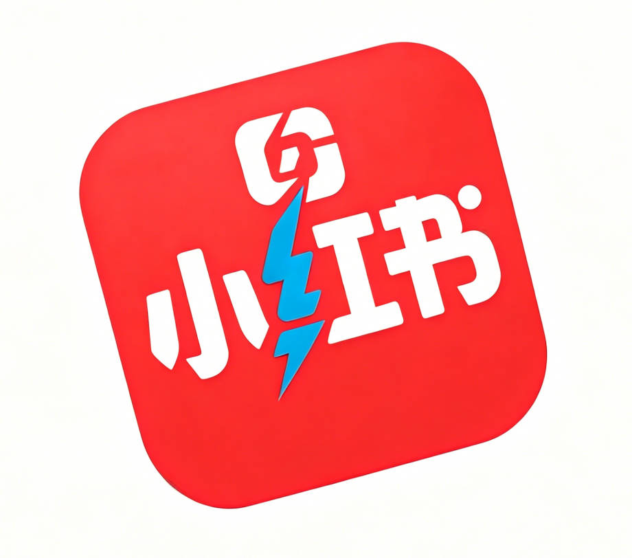
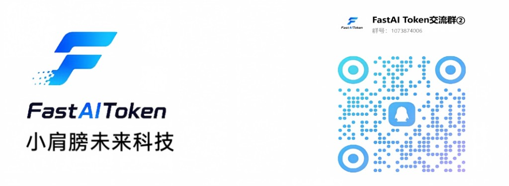

<div align="center">

<p align="center">
  <a href="https://github.com/cv-cat/Spider_XHS" target="_blank">
    <picture>
      
    </picture>
  </a>
</p>

# Spider_XHS

### The All-in-One Manager for XHS

[](https://github.com/cv-cat/XhsSkills)
[](https://www.python.org/)
[](https://nodejs.org/)
[](LICENSE)

<a href="https://trendshift.io/repositories/13631" target="_blank"></a>

</div>

## ❤️Sponsor

> [想出现在这里？](mailto:992822653@qq.com)

<details open>
<summary>点击折叠</summary>

<div align="center">

[](https://www.fastaitoken.com/register?aff=48J4VXUABAAV)

</div>

**FastAIToken** 是面向开发者的 AI API 聚合平台，支持 OpenAI、Claude、Gemini 等主流大模型，兼容 OpenAI API 协议，可无缝接入 **Claude Code、Codex、Gemini CLI、Cherry Studio、Cline、Continue** 等各类 AI 开发工具。平台采用 **充值 1:1（1 元 = 1 美元 API 额度）**，帮助开发者以更低成本、更高效率地使用全球领先的大模型服务。

平台提供多个可选分组与公开状态页，开发者可根据成本、响应速度和稳定性自由选择不同渠道，并享受 **7×24 小时真人技术支持**（非机器人）。

**主要做 AI 开发接入？可以试试 [FastAIToken](https://www.fastaitoken.com/register?aff=48J4VXUABAAV)，兼容 Codex / Claude Code / Gemini CLI 等主流工具。**


---

<table>
<tr>
<td width="180"><a href="https://www.ipwo.net/?ref=githubcvcat"></a></td>
<td><a href="https://www.ipwo.net/?ref=githubcvcat">IPWO</a> 全球住宅代理，为开发者提供灵活的网络访问资源，适用于数据采集、市场研究、AI 应用开发等场景。开发者在不同应用场景下优化访问体验，为小红书数据研究、内容分析以及自动化开发提供更多支持。HTTP/HTTPS/socks5多种协议，免费试用，优惠折扣码“0109”</td>
</tr>

</table>

</details>

## 为什么需要这个项目？

> **在 AI 大模型爆发的时代，内容运营的竞争本质是效率竞争。**
> 本项目封装了小红书平台完整的数据采集与内容发布能力，为开发者构建 AI 运营智能体提供可靠、稳定的底层 API 支撑。

**⚠️ 本项目仅供学习交流使用，禁止任何商业化行为，如有违反，后果自负**

```
采集竞品笔记 ──► [Spider_XHS] ──► 你的 AI Agent（改写 / 生成 / 分析）──► 自动上传发布
                     ▲                                                        │
                     └──────────── 获取数据 / 管理账号 ◄──────────────────────┘
```

小红书没有开放完整的内容运营接口。想要接入 AI 大模型实现内容批量采集、智能改写、一键发布，首先需要能**稳定读写平台数据**。Spider_XHS 解决的正是这个前置问题：

- 逆向还原了小红书 PC 端与创作者平台的签名算法（a1 / web_id / b1 / websectiga / sec_poison_id / gid / x-s / x-t / x-s-common / x-b3-traceid / x-xray-traceid / x-rap-param / search_id / request_id / sign / q-signature 等参数）
- 封装全部核心 HTTP 接口，签名参数已透明处理
- 同时覆盖 **数据采集**（PC端）、**内容发布**（创作者平台）、**KOL数据**（蒲公英）三大场景

**你负责接 AI 大脑，我们负责打通小红书的神经。**

---

## 成品

### repo地址： [XHS_ALL_IN_ONE](https://github.com/cv-cat/XHS_ALL_IN_ONE)

### 账号矩阵 — 多账号绑定与健康管理

支持绑定多个 PC / Creator 账号，扫码登录、手机验证码、Cookie 导入三种方式。Cookie 加密存储，2 小时自动健康巡检，过期自动通知。


### 素材优化 — AI 图片润色

选择草稿中的任意图片，添加参考图，输入润色指令，AI 生成优化后的图片并原位替换。当前素材和优化结果并排对比，点击即可放大预览。


### 发布中心 — 一键发布到小红书

预览草稿内容和图片素材，选择 Creator 账号，设置可见性和发布模式（立即/定时），发布校验通过后一键发布到小红书创作者平台。


---

## 🧩 Skills 支持

当前项目已经支持基于 skills 的能力接入，既可以直接作为 `Spider_XHS` 的底层能力仓库使用，也可以通过标准化 skills 方式被上层 Agent 工具链引入。

如果你希望直接复用已经封装好的 skills，可以查看 [XhsSkills](https://github.com/cv-cat/XhsSkills)。该仓库专门用于存放基于 `Spider_XHS` 封装的 Agent Skills，目前可被 `Clawbot`、`Claude Code`、`Codex` 等支持 skills 的工具直接引入与集成。

---

## ⭐ 已实现功能

| 模块 | 功能 | 状态 |
|------|------|------|
| **小红书 PC 端** | 二维码登录 / 手机验证码登录 | ✅ |
| | 获取主页所有频道 & 推荐笔记 | ✅ |
| | 获取用户主页信息 / 自己的账号信息 | ✅ |
| | 获取用户发布 / 喜欢 / 收藏的所有笔记 | ✅ |
| | 获取笔记详细内容（无水印图片 & 视频） | ✅ |
| | 搜索笔记 & 搜索用户 | ✅ |
| | 获取笔记评论 | ✅ |
| | 获取未读消息 / 评论@提醒 / 点赞收藏 / 新增关注 | ✅ |
| **直播 / 私信** | 直播间连接与事件监听（弹幕 / 点赞 / 进场 / 礼物等） | ✅ |
| | 私信发送与接收（WebSocket + HTTP 兜底） | ✅ |
| **创作者平台** | 二维码登录 / 手机验证码登录 | ✅ |
| | 登录会话级自动重试（406 概率闸门） | ✅ |
| | 上传图集作品 | ✅ |
| | 上传视频作品（含转码轮询） | ✅ |
| | 查看已发布作品列表 | ✅ |
| | 发布接口 Creator RAP 本地纯算 | ✅ |
| **蒲公英平台** | 获取 KOL 博主列表 & 详细数据 | ✅ |
| | 获取博主粉丝画像 & 历史趋势 | ✅ |
| | 发起合作邀请 | ✅ |
| **千帆平台** | 获取分销商列表 & 详细数据 | ✅ |
| | 获取分销商合作品类 / 店铺 / 商品信息 | ✅ |

---

## 🤖 接入 AI 智能体

Spider_XHS 天然适合作为 AI 运营 Agent 的数据底座，以下是几种典型用法：

### 场景一：竞品笔记采集 + AI 改写 + 自动发布

```python
from apis.xhs_pc_apis import XHS_Apis
from apis.xhs_creator_apis import XHS_Creator_Apis
from xhs_utils.xhs_pc import XHSPcAuth
from xhs_utils.xhs_creator import XHSCreatorAuth

pc_auth = XHSPcAuth.from_cookie(pc_cookie)
pc_api = XHS_Apis(pc_auth).bootstrap()
creator_auth = XHSCreatorAuth.from_cookie(creator_cookie)
creator_api = XHS_Creator_Apis(creator_auth).bootstrap()

# 1. 采集竞品笔记
success, msg, note = pc_api.get_note_info(note_url)

# 2. 交给 AI 改写（接入任意大模型）
rewritten = your_ai_agent(note['content'])   # GPT / Claude / Qwen / 本地模型

# 3. 自动上传到创作者平台
creator_api.post_note({
    "title": rewritten['title'],
    "desc": rewritten['desc'],
    "media_type": "image",
    "images": [...],
    ...
})
```

### 场景二：关键词监控 + AI 情报分析

```python
# 搜索指定关键词的最新笔记，交给 AI 分析趋势
success, msg, notes = pc_api.search_some_note(query, require_num, ...)
analysis = your_ai_agent(notes)
```

### 场景三：KOL 筛选 + 智能匹配

```python
from apis.xhs_pugongying_apis import PuGongYingAPI

pgy = PuGongYingAPI()
# 获取目标类目的 KOL 数据，交给 AI 评估匹配度
kol_list = pgy.get_some_user(num=50, cookies=cookies)
best_kols = your_ai_agent(kol_list, brand_profile)
```

---

## 🎨 爬虫效果图

### 处理后的所有用户


### 某个用户所有的笔记


### 某个笔记具体的内容


### 保存的 Excel


---

## 🛠️ 快速开始

### ⛳ 环境要求

- Python 3.10+
- Node.js 20+

### 🎯 安装依赖

```bash
pip install -r requirements.txt
npm install
```

### 🎨 配置登录方式

项目运行不依赖浏览器。直接在 `spider/spider.py` 中设置：

```python
login_type = 'cookie'  # cookie / qrcode / phone
```

- `qrcode`：项目本地请求二维码，用小红书 App 扫码。
- `phone`：项目直接调用手机号验证码登录接口。
- `cookie`：用户登录后直接复制完整 Cookie，或复用本项目登录流程之前保存的完整 Cookie。

只有 `cookie` 模式需要复制 `.env.example` 为 `.env`：

```
COOKIES='your_cookie_here'
```

PC 端统一通过 `XHSPcAuth` 管理登录状态、b1、DS、MNS 环境材料和会话计数：

```python
from apis.xhs_pc_apis import XHS_Apis
from xhs_utils.xhs_pc import XHSPcAuth

# 无浏览器二维码登录
auth = XHSPcAuth.from_qrcode_login()

# 或复用已保存的登录 Cookie
# auth = XHSPcAuth.from_cookie(cookies_str)

# 三种 Auth 工厂都会返回已 bootstrap 的 PC 登录态
api = XHS_Apis(auth)
success, message, data = api.get_unread_message()
```

如果同时需要 PC 内容/直播/私信和 Creator 发布，推荐使用统一入口，只扫码（或输
入手机号）一次：

```python
from apis.xhs_creator_apis import XHS_Creator_Apis
from apis.xhs_live import XHSLiveAPI
from xhs_utils.xhs_auth import XHSUnifiedAuth
from apis.xhs_pc_apis import XHS_Apis

auth = XHSUnifiedAuth.from_qrcode_login()
try:
    pc_api = XHS_Apis(auth.pc)
    creator_api = XHS_Creator_Apis(auth.creator).bootstrap()
    live_api = XHSLiveAPI(auth.pc)
finally:
    auth.close()
```

主站和 Creator 复用同一组服务端登录 Cookie，`auth.creator` 在第一次使用时才懒
初始化；两边的 Storage、b1、MNS 和 X-s 按各自站点独立维护。仅单独使用 Creator
时也可通过兼容工厂创建：

```python
from apis.xhs_creator_apis import XHS_Creator_Apis
from xhs_utils.xhs_creator import XHSCreatorAuth

# 仅单独使用 Creator 时三选一（兼容入口）：
creator_auth = XHSCreatorAuth.from_qrcode_login()
# creator_auth = XHSCreatorAuth.from_phone_login()
# creator_auth = XHSCreatorAuth.from_cookie(完整_creator_cookie)

creator_api = XHS_Creator_Apis(creator_auth).bootstrap()
success, message, notes = creator_api.get_all_posted_notes()
```

几点说明：

- 签名与指纹（b1、MNS、X-s、X-S-Common、x-rap-param、profileData 等）全部本地纯算，算法唯一实现在 `xhs_utils/xhs_core/js/`；全程不启动、不连接浏览器。
- 二维码/手机号登录会自动完成设备初始化和 Storage 维护（webSsk 协商、直播/私信所需的 RWP token 等）；登录与发布中的概率性 406 / `code=-1` 拒绝已内置自动重试。
- `web_session` 是服务端签发的登录凭证，无法通过算法伪造；cookie 模式原样复用用户提供的完整 Cookie。
- 正常使用无需传 b1、DSL 或浏览器 Storage；这些覆盖参数仅供逆向调试和版本对齐，且只能通过 `from_cookie()` 传入。

### 🚀 运行项目

笔记链接、用户链接、搜索关键词、保存方式和搜索筛选参数直接在 `spider/spider.py` 的入口示例中修改。

```bash
python -m spider.spider
```

发布 / 直播监听 / 私信示例见根目录 `demo.py`，修改顶部参数后运行 `python demo.py`。

### 🐳 Docker 部署（可选）

```bash
docker build -t spider_xhs .
docker run -e COOKIES='your_cookie_here' spider_xhs
```

---

## 📁 项目结构

```
Spider_XHS/
├── spider/
│   ├── __init__.py
│   └── spider.py                    # 主入口：爬虫调用示例
├── demo.py                          # 扫码登录后的发布/直播/私信最小示例
├── apis/
│   ├── xhs_pc_apis.py               # 小红书PC端完整API（采集）
│   ├── xhs_creator_apis.py          # 创作者平台API（上传发布）
│   ├── xhs_pc_login_apis.py         # PC端登录（二维码/手机验证码）
│   ├── xhs_live.py                   # 直播间 HTTP/RWP/IM（抓包对齐）
│   ├── xhs_creator_login_apis.py    # 创作者平台登录
│   ├── xhs_pugongying_apis.py       # 蒲公英平台API（KOL数据）
│   └── xhs_qianfan_apis.py          # 千帆平台API（分销商数据）
├── xhs_utils/
│   ├── common_util.py               # 初始化工具（读取.env配置）
│   ├── cookie_util.py               # Cookie解析
│   ├── data_util.py                 # 数据处理（Excel保存、媒体下载）
│   ├── xhs_pc/                      # PC 鉴权、状态与请求装配（js/ 为 PC 特有模板）
│   ├── xhs_creator/                 # Creator 鉴权、状态与请求装配（js/ 为 Creator 特有模板）
│   ├── xhs_core/                    # PC/Creator 共用签名算法唯一实现（js/）
│   ├── xhs_auth.py                  # PC/Creator 统一登录入口
│   ├── xhs_util.py                  # 旧导入路径兼容层
│   ├── xhs_creator_util.py          # Creator上传/发布业务数据辅助
│   ├── xhs_pugongying_util.py       # 蒲公英平台工具
│   └── xhs_qianfan_util.py          # 千帆平台工具
├── .env.example                     # 本地配置模板；复制为 .env 使用
├── requirements.txt
├── Dockerfile
└── package.json
```

---

## 🗝️ 注意事项

- `spider/spider.py` 是爬虫入口，可根据需求修改调用逻辑
- `apis/xhs_pc_apis.py` 包含所有 PC 端数据接口
- `apis/xhs_live.py` 提供直播间事件接收、弹幕发送与私信收发；发送端仅支持文本消息，不会发送礼物
- `apis/xhs_creator_apis.py` 包含创作者平台发布接口
- `xhs_utils/xhs_pc/` 是 PC 端鉴权、参数状态和签名算法的统一入口
- `xhs_utils/xhs_creator/` 是 Creator 端鉴权、参数状态和签名装配的统一入口
- Cookie 有时效性，失效后需重新获取
- 建议配合代理（proxies 参数）使用，降低封号风险

---

## 🍥 更新日志

| 日期 | 说明 |
|------|------|
| 23/08/09 | 首次提交 |
| 23/09/13 | API 更改 params 增加两个字段，修复图片无法下载，修复部分页面无法访问报错 |
| 23/09/16 | 修复较大视频编码问题，加入异常处理 |
| 23/09/18 | 代码重构，加入失败重试 |
| 23/09/19 | 新增下载搜索结果功能 |
| 23/10/05 | 新增跳过已下载功能，获取更详细的笔记和用户信息 |
| 23/10/08 | 上传至 PyPI，可通过 pip install 安装 |
| 23/10/17 | 搜索下载新增排序方式（综合 / 热门 / 最新） |
| 23/10/21 | 新增图形化界面，上传至 release v2.1.0 |
| 23/10/28 | Fix Bug：修复搜索功能隐藏问题 |
| 25/03/18 | 更新 API，修复部分问题 |
| 25/06/07 | 更新 search 接口，区分视频和图集下载，新增创作者平台 API |
| 25/07/15 | 更新 xs version56 & 小红书创作者接口 |
| 26/04/11 | 重构创作者平台 API（图集 / 视频上传），新增蒲公英 KOL 数据 API，新增千帆分销商 API，签名算法升级至最新版 |
| 26/04/28 | 更新 PC 端搜索与笔记详情风控参数，新增 `search_id` 当前算法与 `x-rap-param` 本地 JSVMP 生成，补充 `a1`、`web_id`、`websectiga` 等签名参数说明 |
| 26/07/25 | 更新全部算法：登录 406 自动重试、b1 会话级抖动、发布链路对齐浏览器实抓、XHR 去除 sec-ch-ua* |
| 26/09/07 | Chrome 152 复核：PC 升级 X-s 4.4.3 并加入 webSsk 协商；Creator 升级 webBuild=1.26.0；新增直播/私信接口与根目录 `demo.py` |

---

## 🧸 额外说明

1. 感谢 Star ⭐ 和 Follow，项目会持续更新
2. 作者联系方式在主页，有问题随时联系
3. 欢迎 PR 和 Issue，也欢迎关注作者其他项目
4. 如果此项目对您有帮助，欢迎请作者喝一杯奶茶 ~~（开心一整天 😊）

<div align="center">
  
  
</div>

---

## 📈 Star 趋势

<a href="https://cvcat.site/star-history/svg?repos=cv-cat/Spider_XHS&type=Date">
  <picture>
    <source media="(prefers-color-scheme: dark)" srcset="https://cvcat.site/star-history/svg?repos=cv-cat/Spider_XHS&type=Date&theme=dark" />
    <source media="(prefers-color-scheme: light)" srcset="https://cvcat.site/star-history/svg?repos=cv-cat/Spider_XHS&type=Date" />
    
  </picture>
</a>

---


## 🍔 交流群

如果你对爬虫和 AI Agent 感兴趣，可以加入群聊一起讨论~

ps: 请加群，人满或者过期 issue | wx 提醒 | qq提醒

| group-1 | group-2 | group-3 | group-4 (2000人qq群) |
|:--:|:--:|:--:|:--:|
|  |  |  |  |


